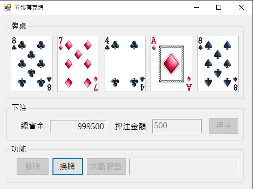

# Poker
學號：1131203 姓名：侯采妤
## 專案簡介
本專案開發了一款具備完整下注邏輯與牌型判斷功能的撲克牌遊戲。除了能自動洗牌、發牌與換牌外，還內建了精確的賠率結算系統，並主動攔截「餘額不足」或「非數字輸入」等異常狀況，確保遊戲過程穩定且具備流暢的博弈體驗。
## 使用者畫面

## 執行說明書與結果判讀
### 操作流程說明
請依序執行以下步驟進行遊戲：
1. **押注金額**：在下注區填寫欲押注的金額，並按下「押注」按鈕。
2. **發牌**：下注成功後，「發牌」按鈕將會啟用，點擊後會由系統洗牌並發出五張手牌。
3. **換牌**：點擊牌面可選擇要保留或換掉的牌（背面代表換掉），按下「換牌」後系統會補齊手牌。
4. **判斷牌型**：完成手牌組合後，按下「判斷牌型」進行結算，系統將依賠率發放獎金。

### 功能按鈕
* **押注**：檢查金額並從總資金中扣除下注金。
* **發牌**：清空上一場結果，重新洗牌並發放五張新手牌。
* **換牌**：將玩家選擇換掉的牌替換為新的撲克牌。
* **判斷牌型**：分析手牌組合，顯示中獎名稱並自動更新總資金。

### 異常輸入與錯誤防治機制
為避免程式因邏輯錯誤崩潰或產生不合理的遊戲結果，系統設有以下攔截警告：
1. **下注金額格式驗證**
  * 異常狀況：輸入文字、特殊符號或留白。
  * 系統處理：彈出「請輸入正確的押注金額」警告，防止資料解析失敗導致程式崩潰。
2. **資金餘額防護**
  * 異常狀況：押注金額超過當前擁有的「總資金」。
  * 系統處理：跳出「總資金不足」警告，禁止不合邏輯的透支行為。
3. **負數或零押注攔截**
  * 異常狀況：押注金額小於或等於 0。
  * 系統處理：強制要求輸入大於 0 的正整數。
4. **流程狀態鎖定**
  * 異常狀況：在尚未下注前嘗試發牌，或在判定牌型後重複換牌。
  * 系統處理：系統會根據遊戲階段自動切換按鈕的「啟用/停用」狀態，確保玩家無法跳過必要步驟。

### 結果判讀說明
結算成功後，下方訊息欄將顯示以下資訊：
* **牌型名稱**：顯示玩家最終獲得的牌型（如：同花、鐵支、葫蘆等）。
* **中獎獎金**：根據押注金額與牌型賠率計算出的獲得金額。
  * *範例：押注 100 獲得一對，獎金為 100 (1倍)；獲得同花大順，獎金為 25,000 (250倍)。*
* **總資金更新**：即時反應扣除下注與加上獎金後的最新餘額。
* **密技觸發提示**：若使用 QWER 測試功能，系統將直接顯示對應的測試牌型。
